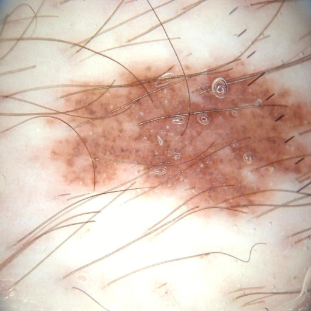
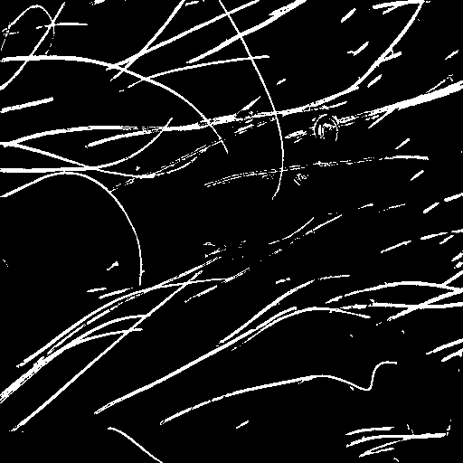
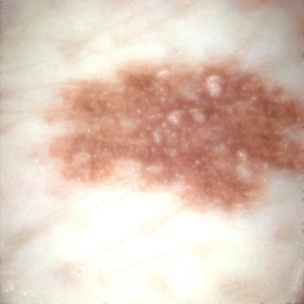

Skin lesion segmentation focuses on identifying and isolating lesions, such as melanoma, from the surrounding skin in images like dermoscopic photographs. However, hair occlusion in dermoscopic images impacts both the diagnostic process and the accuracy of skin lesion analysis.

In this project, we developed a framework to detect hairs in dermoscopic images and subsequently remove them using a GAN. The processed dermoscopic images can then be used to detect skin lesions through specialized networks (e.g., a melanoma segmentation network), resulting in improved detection and segmentation of lesions.

Refer to the [Generative Image Inpainting](https://github.com/JiahuiYu/generative_inpainting) repository to download the GAN weights.

An example of a hair-occluded image, along with the segmented hair mask and inpainted image, is shown below.

